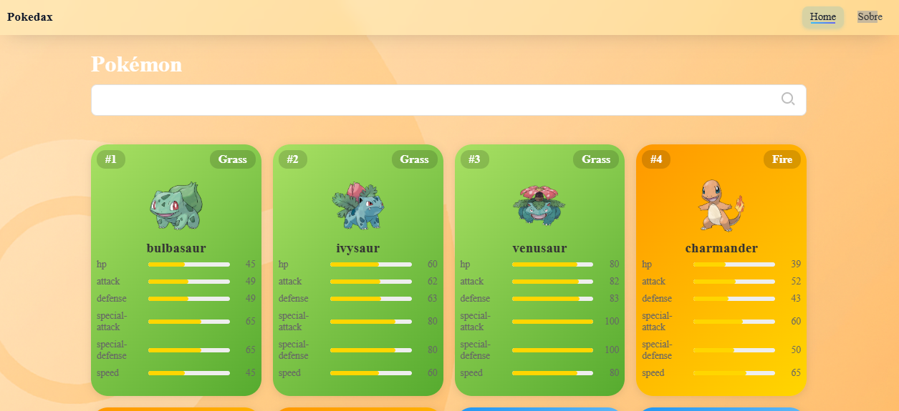
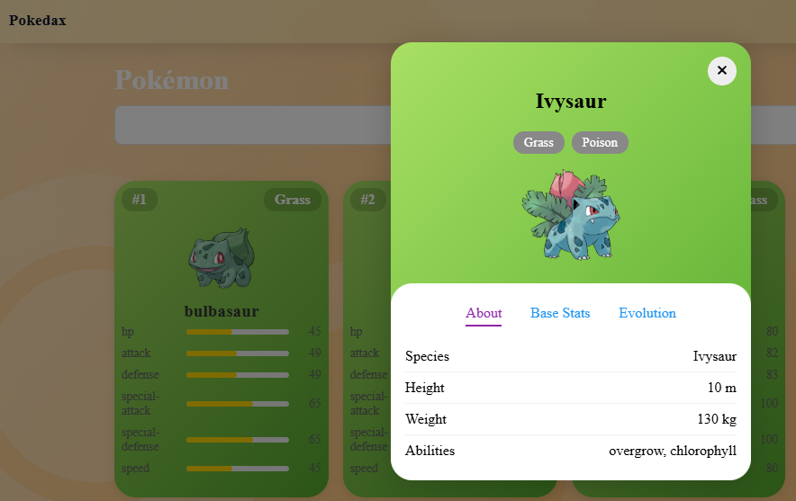

<div align="center">

# Pokedax

Uma Pokédex moderna construída em Angular, com lista paginada, busca por autocomplete e modal com informações completas (About + Evolutions).

[](https://angular.io/) 
[](https://www.typescriptlang.org/) 
[](https://rxjs.dev/) 
[](https://sass-lang.com/) 
[](https://pokeapi.co/)

</div>

## ✨ Destaques

- Lista de Pokémons paginada com cards responsivos
- Busca por autocomplete integrada à PokéAPI
- Modal com abas: About (altura, peso, habilidades) e Evolution (cadeia completa)
- Cores dinâmicas por tipo (SASS + classes utilitárias)
- Layout suave e consistente, com Navbar fixa e visual “glassy”

## 🖼️ Screenshots

> Home (listagem e busca)



> Card e base stats (exemplo)



## Acessar URL

> https://pokedax-git-main-brmartins92s-projects.vercel.app/

## 🚀 Como rodar

Pré-requisitos: Node.js LTS e npm instalados.

1. Instale as dependências
	 - npm install
2. Rode em desenvolvimento
	 - npm start
3. Acesse em
	 - http://localhost:4200/

## 🧭 Rotas

- `/` Home: listagem, busca e modal de detalhes
- `/sobre` Sobre: informações do projeto e stack utilizada

## 🧩 Principais componentes

- `share/components/navbar` – Navbar fixa com rotas para Home e Sobre
- `share/components/autocomplete` – Campo de busca com sugestões
- `share/components/table` – Tabela/lista paginada de Pokémons
- `share/components/pokemon-card` – Card com imagem, tipo, número e stats
- `share/components/modal-pokemon` – Modal com “About” (altura, peso, abilities) e “Evolution”

## 🏗️ Arquitetura em alto nível

- Angular 13 + TypeScript + RxJS
- Serviço central de dados: `core/services/pokemon.service.ts` (lista, detalhe, cadeia de evolução)
- Estilos com SASS; classes por tipo para cores/coerência visual
- Data flow enxuto: tabela → card → modal via um único objeto de dados

## 📁 Estrutura (resumo)

```
src/
	app/
		app.module.ts
		app-routing.module.ts
		pages/
			home/
				home.component.ts|html|sass
			sobre/
				sobre.component.ts|html|sass
		share/
			components/
				navbar/
				autocomplete/
				table/
				pokemon-card/
				modal-pokemon/
		core/
			services/
				pokemon.service.ts
```

## 📌 Roadmap (ideias futuras)

- Favoritar Pokémons (localStorage)
- Filtros por tipo/geração
- Animações extras na transição do modal
- Testes unitários de serviço e componentes principais

## 🤝 Contribuindo

Sinta-se à vontade para abrir issues e PRs com melhorias, correções ou novas ideias.

---

Feito com ❤️ utilizando Angular, TypeScript e a PokéAPI.


